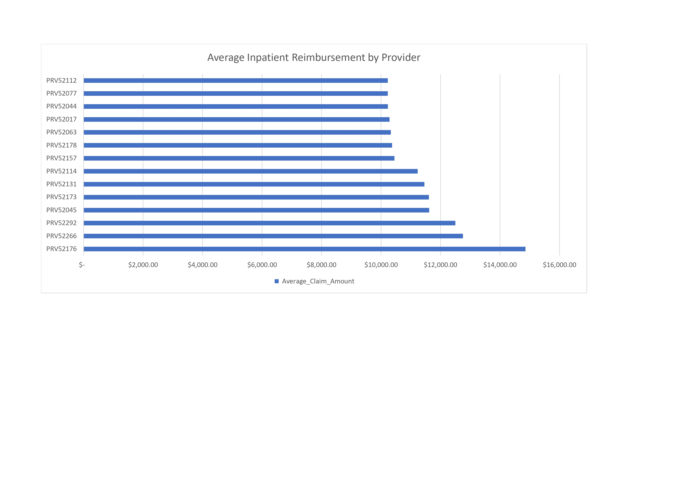

# Medicare Provider Fraud & Claims Analysis

## Project Overview
This project focuses on identifying potential anomalies in healthcare billing practices. By analyzing Medicare inpatient claims and beneficiary data using SQLite, the objective was to pinpoint high-volume healthcare providers with unusually high average reimbursement claims.

## Tools Used
* **SQL (SQLite):** Executed relational queries (`JOIN`, `GROUP BY`, `HAVING`) to merge patient demographics with inpatient billing records.
* **Microsoft Excel:** Formatted and visualized query outputs to isolate high-risk providers for compliance review.

## Key Files
* `fraud_detection_queries.sql`: Structured SQL script filtering providers by state and minimum claim volume.
* `helthcare_claims_query.csv`: Query output data sorted by average reimbursement amount.
* `Healthcare_Claims_Analysis.xlsx`: Interactive workbook containing cleaned data and the provider reimbursement dashboard.
* `Healthcare_Claims_Analysis.pdf`: High-resolution export of the analytics dashboard.

## Key Insights
* Isolated high-volume providers in State 10 with over 20 inpatient claims whose average reimbursements significantly exceed regional baselines.
* Created a targeted, ranked list of provider IDs (e.g., `PRV52176` averaging over $14,800/claim) to support compliance and audit reviews.
